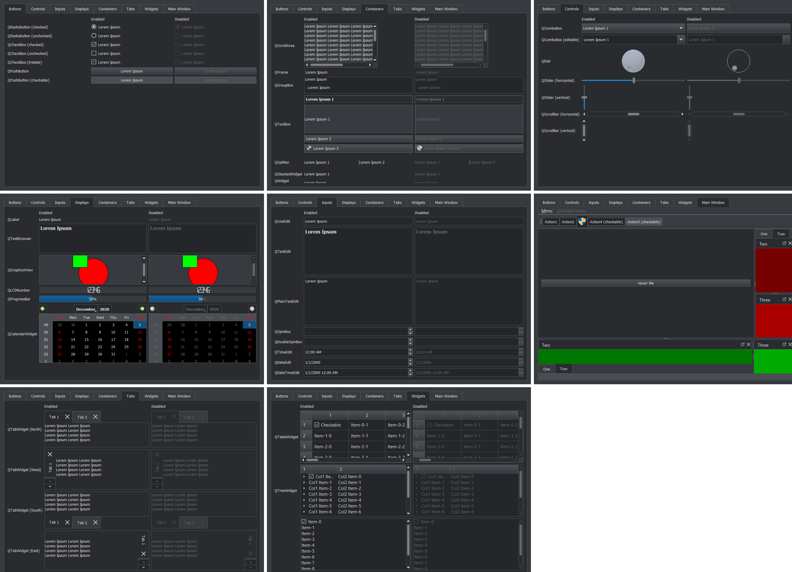

# About

This package provides a modern light and dark theme for PyQt5. I made this because I was not satisfied with alternatives:

- [qtmodern](https://github.com/gmarull/qtmodern) overrides QPalette but I needed a purely stylesheet-based solution
- [QDarkStyleSheet](https://github.com/ColinDuquesnoy/QDarkStyleSheet) and [BreezeStyleSheets](https://github.com/Alexhuszagh/BreezeStyleSheets) had some visual bugs and a different aesthetic than what I wanted

# Screenshots




# Installation

```
pip install qtstylish
```

# Usage

- Copy `qtstylish.py` and the `compiled` folder into your project and access the light and dark stylesheets like below.

```
import qtstylish
my_widget.setStyle(QtWidgets.QStyleFactory.create("Fusion"))
my_widget.setStyleSheet(qtstylish.light())
```

# More Info

- Works best with app style set to Fusion
- Icons are mostly modified from https://github.com/microsoft/fluentui-system-icons
- Uses qtsass for compiling to QSS https://github.com/spyder-ide/qtsass
- Took some SCSS & ideas from https://github.com/ColinDuquesnoy/QDarkStyleSheet and https://github.com/Alexhuszagh/BreezeStyleSheets

# Alternatives

- QDarkStyleSheet
- BreezeStyleSheets
